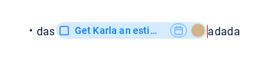

# AT-2697: caret and selection beside inline task tags

Follow-up to MR !637 (`00431364d097c07bc1c7765e728eb273c8c42667`).

The production note enables `enableDeferredNoteEmbeds` **before** loading its
content. On activation the task mount kept its **480px placeholder width**.
The real task row (long title, date, avatar) could overflow that box, while
Quill's right guard and the following text still used the placeholder edge.
This put the caret and the text under the task. The first harness mostly used
eager rendering, a short title and an empty date stub, so it missed this path.

The fix releases the task placeholder dimensions **before** mounting React.
The normal `display: contents` mount lets the complete task determine the inline
box and the guard position. Reserved image/video sizes stay unchanged.

The expanded selection test also exposed Quill's embed arrow handler claiming
noncollapsed selections: selecting only `adada` after the tag, then pressing
Left, jumped before the task. `NoteQuill` now collapses an unmodified Left/Right
at the selected edge when that edge touches a task. Collapsed navigation, Shift
selection, modified arrows and other embeds keep their existing handlers.

The fixture uses the real `NoteQuill`, task blot, wrapper, row, `DateTagButton`,
`DateTag`, avatar `Image`, icons, responsive task popup shell and note CSS. It
loads the repository's fonts. Backend/navigation, secondary controls, popup
contents and popup scroll locking are isolated; no account or network is needed.
It is an editor-component reproduction, not a logged-in production session.

Coverage at 1280px and 390px:

- Both eager and deferred rendering of `das` + task + `adada`, **no spaces**, in
  a bullet, plus plain text, standalone tags, adjacent tags and separate lines.
- Full rendered right edge (including date/avatar), following-character range
  rectangles and no overlap, independently of Quill's own bounds.
- Native selection stays editable; arrows into `adada` reach its real text node.
  A collapsed DOM range at an element boundary can legitimately measure zero;
  the editable guard and actual painted caret are checked separately.
- Real clicks, drag and Shift selection of only `adada`, collapse, typing,
  selected-text replacement, text/tag deletion and keyboard undo.
- Before/between-tag editing, atomic delete/undo, Enter, task/date popup opening and
  closing, offscreen activation via native find and read-only inheritance.
- Click mapping and painted caret with a translated/scaled editor ancestor.
  DOM and Quill rectangles are viewport coordinates; no extra app offset is used.

Chromium checks **painted native caret pixels**, with `caret: 'initial'`
screenshots. Only the fixture caret is red; detection permits subpixel
antialiasing when scaled and cannot confuse the tan avatar with a caret.
Firefox runs the same geometry and editing checks with `--geometry-only`:
headless Firefox in this VM does not capture caret pixels even in a plain input.

Negative controls: the expanded harness fails on unchanged master with
`row overflows Quill tag` for the deferred bullet case. Keeping only the geometry
fix still fails `collapse following selection` (index 3 instead of 4). Both fixes
are required for the new regressions to pass.

```bash
nvm use
# Reuse existing dependency trees; install only missing tooling.
(cd web-bundler && npm install)
npm install --prefix /tmp/at2697-tools --no-audit --no-fund playwright pngjs
/tmp/at2697-tools/node_modules/.bin/playwright install chromium firefox

PLAYWRIGHT_MODULE=/tmp/at2697-tools/node_modules/playwright \
PNGJS_MODULE=/tmp/at2697-tools/node_modules/pngjs \
node browser-tests/at2697/run.js

BROWSERS=firefox \
PLAYWRIGHT_MODULE=/tmp/at2697-tools/node_modules/playwright \
PNGJS_MODULE=/tmp/at2697-tools/node_modules/pngjs \
node browser-tests/at2697/run.js --skip-build --geometry-only

npm test -- --runInBand \
  components/Feeds/CommentsTextInput/autoformat/formats/noteEmbedVisibility.test.js \
  components/NotesView/NotesDV/EditorView/taskTagSelection.test.js \
  components/NotesView/NotesDV/EditorView/NoteQuill.test.js

# Full app development server:
npm run dev
```

Use Playwright's `install-deps` when browser system libraries/fonts are missing.
For this VM's extracted library/browser cache the browser commands also require:

```bash
export LD_LIBRARY_PATH=/tmp/at2697-libs/usr/lib/x86_64-linux-gnu
export FONTCONFIG_FILE=/tmp/at2697-fonts.conf
export PLAYWRIGHT_BROWSERS_PATH=/home/user/.cache/alldone-vm/at2697-browsers
```

Generated bundles and diagnostics are in `.build/` (gitignored). Browser tests
are manual and **not included in the Jest CI job**. Safari/WebKit could not run
in this VM because its system libraries are missing. Actual Safari, real touch
keyboards, installed mobile apps, browser zoom and production require separate
verification; a 390px viewport is not a device test.

Verified for this follow-up: 57 Jest tests in 8 related suites, the full Chromium
pixel/interaction run and the full Firefox geometry/interaction run at both
viewport widths. This does not verify the production deployment.
The harness webpack build passes. The full `npm run build-web-webpack` was killed
with exit 137 in the 2GB VM, including a retry with
`NODE_OPTIONS=--max-old-space-size=1024`; the full app build needs CI verification.

The red caret in these captures is fixture-only:

| Case                                                         | Capture                                          |
| ------------------------------------------------------------ | ------------------------------------------------ |
| Master: following text/caret covered by the overflowing task |        |
| Fixed desktop: caret at the start of `adada`                 |          |
| Fixed mobile viewport: caret after the task                  |  |
