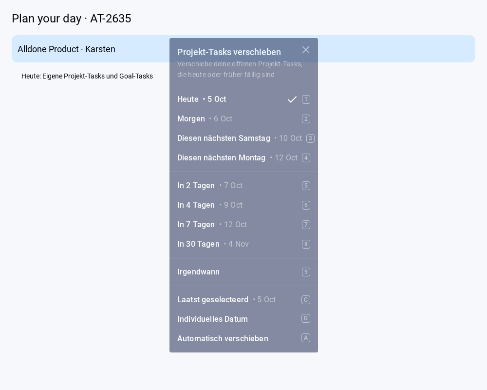

# AT-2635: Postpone project planning tasks

Swipe left on the project header in your own Open task board to open the existing reminder picker. Choose a fixed date, a calendar date, Someday, or Auto postpone. Selecting a date is the confirmation; there is no additional confirmation dialog.

The implementation uses the recommended defaults presented during the interactive task. These product choices were not explicitly confirmed by a reply:

- Include readable, unfinished tasks whose `currentReviewerId` is the authenticated user and whose `dueDate` is today or earlier in the browser's timezone. This includes goal tasks and eligible subtasks, even when collapsed, filtered out or not yet loaded.
- Leave future tasks, shared workstream tasks, tasks assigned to other reviewers, and other users' observer reminder dates unchanged.
- Fixed dates apply the same date to all eligible tasks. Auto postpone reuses the existing per-task escalation (3 days, 1 week, 1 month, 3 months, 6 months, 1 year, then Someday).
- Record one server-side undo action. Preserve task relationships and recurring-task original dates. Goal reminder dates and milestones are unchanged.

The callable selects and updates tasks transactionally and checks project membership and task visibility. Request IDs prevent duplicate execution. The shared undo limit is 450 tasks; exceeding it rejects the whole operation without partial updates. Errors remain visible in the picker for retry. Focus replacement uses the existing conditional focus service after the task transaction.

## Run and deploy

Use Node 22 and npm 10. With the repository dependencies and the existing local `.env` configured, run `npm run dev`, open your own Open task board and swipe left on a project header.

The frontend requires the new callable `postponeProjectTasksWithUndoSecondGen` in `europe-west1`. Deploy it to the chosen environment through the existing Functions deployment process before releasing the frontend. No Firestore rules, index, environment variable or data migration changes are needed. This task did not deploy to production.

## Automated checks

```sh
npm test -- --runInBand --watch=false \
  components/TaskListView/Header/ProjectPostponeSwipe.test.js \
  components/UIComponents/DueDateSinglePopup.test.js \
  components/UIComponents/FloatModals/DueDateModal/ProjectPostpone.test.js \
  components/UIComponents/FloatModals/DueDateModal/AutoPostpone.test.js \
  components/TaskListView/OpenTasksView/OpenTasksByProjectComposerRecovery.test.js \
  utils/backends/Tasks/projectPostpone.test.js \
  components/TaskListView/Header/ProjectHeaderLineExit.test.js \
  components/TaskListView/OpenTasksView/SwipeableGeneralTasksHeader.test.js

npx jest --config ci/jest.functions.config.js --runInBand \
  functions/Tasks/projectPostponeService.test.js \
  functions/Goals/goalPostponeService.test.js \
  functions/shared/UndoActionService.test.js
```

These targeted suites pass: 60 frontend tests and 32 backend tests. Repository formatting and `git diff --check` were run. An isolated webpack build of the affected UI components passed. The full production web build was killed by the 2 GB VM's memory limit (exit 137), so CI must supply the full build check. Live Firestore/Functions and physical mobile verification remain outstanding.

## Browser review

An isolated Chromium fixture using the real project header/swipe and date-picker components passed: real mouse swipe opens the picker; the trailing gesture click does not activate the header; selecting Tomorrow sends one project operation; a simulated offline failure stays visible and can be retried; the header remains clickable afterward. Header labels/navigation and backend calls were fixture stand-ins. This is not a live Firebase or physical touch-device test.


