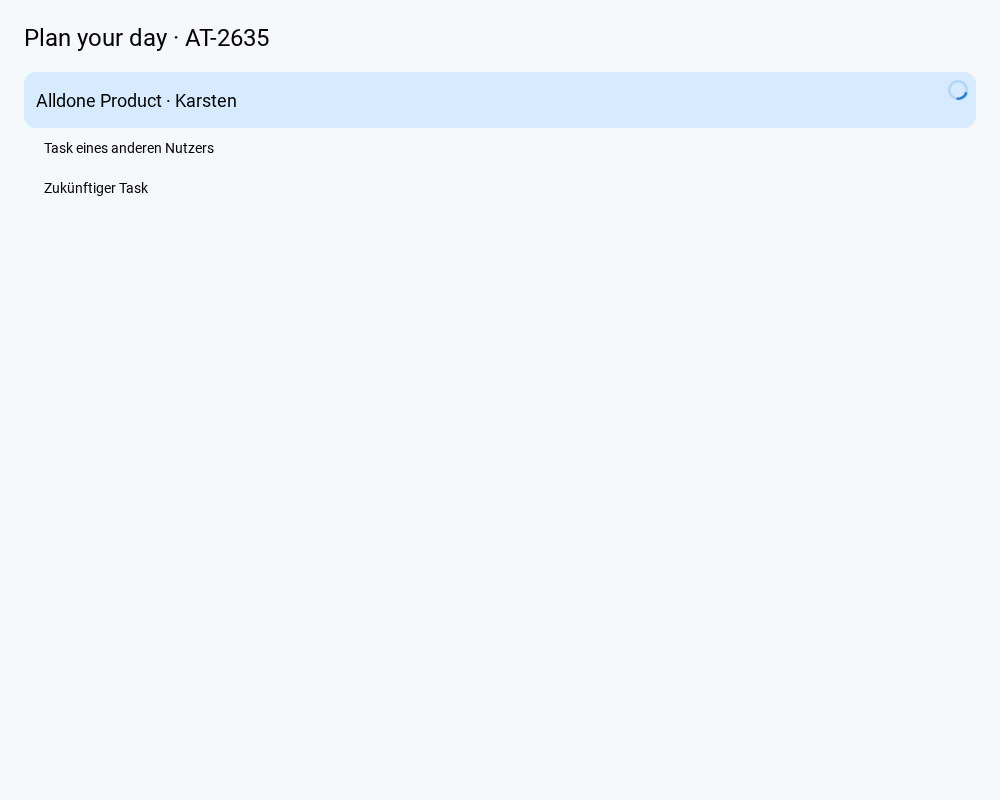

# AT-2635: Postpone project planning tasks

Swipe left on the project header in your own Open task board to open the existing reminder picker. Choose a fixed date, a calendar date, Someday, or Auto postpone. Selecting a date is the confirmation; there is no additional confirmation dialog.

The implementation uses the recommended defaults presented during the interactive task. These product choices were not explicitly confirmed by a reply:

- Include readable, unfinished tasks whose `currentReviewerId` is the authenticated user and whose `dueDate` is today or earlier in the browser's timezone. This includes goal tasks and eligible subtasks, even when collapsed, filtered out or not yet loaded.
- Leave future tasks, shared workstream tasks, tasks assigned to other reviewers, and other users' observer reminder dates unchanged.
- Fixed dates apply the same date to all eligible tasks. Auto postpone reuses the existing per-task escalation (3 days, 1 week, 1 month, 3 months, 6 months, 1 year, then Someday).
- Record one server-side undo action. Preserve task relationships and recurring-task original dates. Goal reminder dates and milestones are unchanged.

The callable selects and updates tasks transactionally and checks project membership and task visibility. Request IDs prevent duplicate execution. The shared undo limit is 450 tasks; exceeding it rejects the whole operation without partial updates. The picker closes immediately on selection. Loaded eligible task rows update optimistically while the cloud persists in the background; failures restore the preview and show a translated alert so the picker can be reopened to retry. Focus replacement uses the existing conditional focus service after the task transaction.

## Run and deploy

Use Node 22 and npm 10. With the repository dependencies and the existing local `.env` configured, run `npm run dev`, open your own Open task board and swipe left on a project header.

The frontend requires the new callable `postponeProjectTasksWithUndoSecondGen` in `europe-west1`. Deploy it to the chosen environment through the existing Functions deployment process before releasing the frontend. No Firestore rules, index, environment variable or data migration changes are needed. This task did not deploy to production.

## Automated checks

```sh
npm test -- --runInBand --watch=false \
  components/TaskListView/Header/ProjectPostponeSwipe.test.js \
  components/UIComponents/DueDateSinglePopup.test.js \
  components/UIComponents/FloatModals/DueDateModal/ProjectPostpone.test.js \
  components/UIComponents/FloatModals/DueDateModal/AutoPostpone.test.js \
  components/TaskListView/OpenTasksView/OpenTasksByProjectComposerRecovery.test.js \
  utils/backends/Tasks/projectPostpone.test.js \
  components/TaskListView/Header/ProjectHeaderLineExit.test.js \
  components/TaskListView/OpenTasksView/SwipeableGeneralTasksHeader.test.js

npx jest --config ci/jest.functions.config.js --runInBand \
  functions/Tasks/projectPostponeService.test.js \
  functions/Goals/goalPostponeService.test.js \
  functions/shared/UndoActionService.test.js
```

## Immediate feedback follow-up (October 5, 2026)

MR !626 is merged into master (`2708e441ff`); its production pipeline 2912402957 and Web/Functions deployment jobs are successful, verified through GitLab. This follow-up changes only the client and requires no new function, configuration, index or migration.

All picker paths (fixed date, calendar, Someday and Auto) dismiss immediately. Eligible loaded rows disappear from the current list for a future target; same-day selections update their displayed date. A small project-header indicator shows background persistence. Empty goal reminders, other users' tasks, future tasks and unaffected children stay visible. The authoritative cloud selection still includes collapsed/unloaded eligible tasks and enforces the existing atomic 450-task limit.

The preview never writes to the Firestore cache. It is scoped by project, actor and request ID; repeated choices share the pending operation. Failure discards only that preview, preserving newer live edits, and reports an error after popup unmount. Live task changes retire individual previews so undo cannot reactivate a stale hide. Successful undo clears any remaining preview, including when the postpone response arrives later. Unconfirmed previews expire 15 seconds after success; pending requests keep their feedback until they settle. Task counts and day/goal grouping continue to follow the live listener data.

Validation: 112 frontend tests in 12 focused/adjacent suites and 32 backend tests in 3 suites pass. These cover pending-backend row updates and popup dismissal, success, failure/rollback, same-day dates, duplicate requests, independent projects, live-edit races, successful/failed undo, mixed task families, scope and the bulk limit. Repository formatting and `git diff --check` pass.

The isolated webpack fixture compiles and passes in Chromium using the real header/swipe, picker, project postpone service and TasksList. Its backend promise is manually held pending: selecting Tomorrow closes the popup and removes own/goal rows before resolving the promise, preserves foreign/future rows, and restores rows with a visible alert on rejection. Task row labels, navigation and backend transport are fixture stand-ins. This fixture is not an authenticated live Firebase or touch-device test.



The full production build was attempted locally and stopped after memory pressure in the 2 GB VM killed an adjacent Jest run; that test coverage was rerun successfully in smaller groups. The full CI build, authenticated live postpone/undo and physical mobile checks remain outstanding. Start the client with `npm run dev` and test the own Open task board; no follow-up merge or deployment has been authorized.
